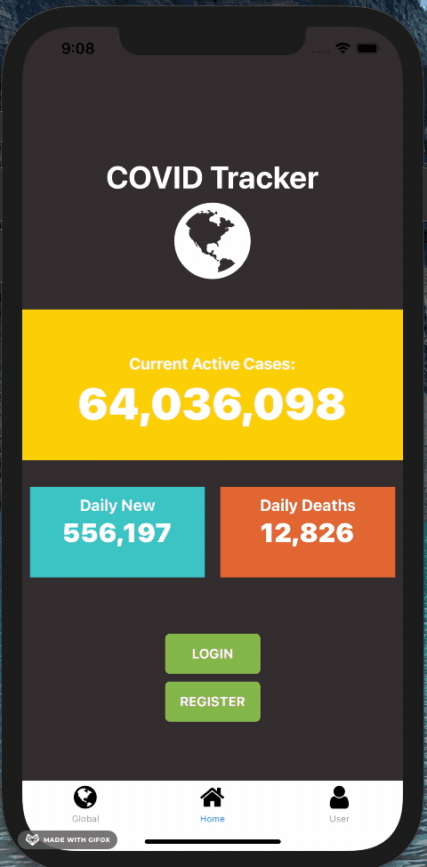
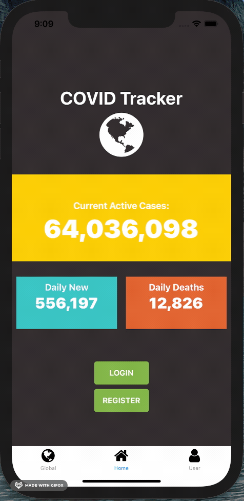

# CovidTracker

sabkuah, Feb 13

## Features

- Consume Covid-19 Data API
- Platform specific drawer / bottom tab navigation
- Firebase authentication to store user's location
- Display case numbers
- Search by country
- Display location with react-native-maps & MapBox

## Screens

(\*) = on navigation

- User Dashboard\* - displays information specific for user's stored location
- Global\* - displays cluster map of cases world-wide
- Home\* - displays latest totals & login button for redirect if user is not signed in
- Login Screen - email, password
- Register screen - email, location, password

## Sample JSON:

Object {
"cases": Object {
"1M_pop": "69249",
"active": 278,
"critical": 11,
"new": "+13",
"recovered": 7067,
"total": 7413,
},
"continent": "North-America",
"country": "Aruba",
"day": "2021-02-15",
"deaths": Object {
"1M_pop": "635",
"new": null,
"total": 68,
},
"population": 107048,
"tests": Object {
"1M_pop": "889853",
"total": 95257,
},
"time": "2021-02-15T22:30:06+00:00",
},

## Color Palette

Flame e4572e
Max Blue Green 17BEBB
Sunglow FFC914
Raisin Black 2E282A
Green RYB 76B041
